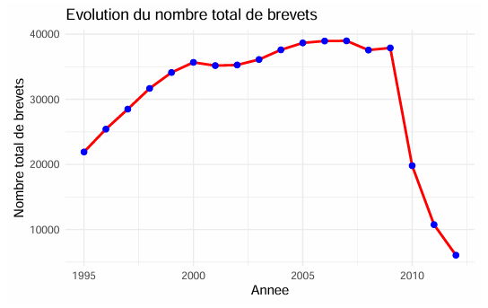
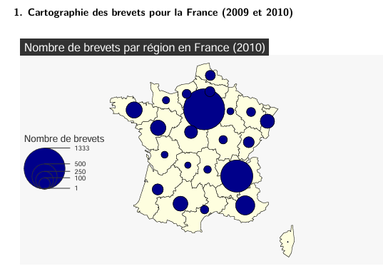
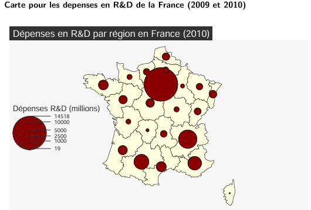
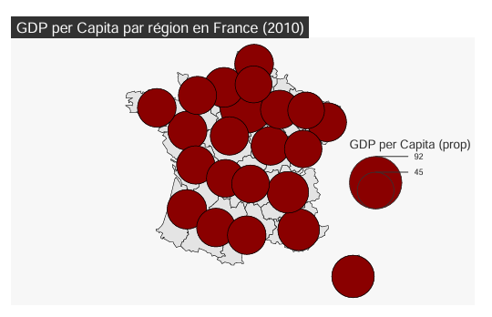
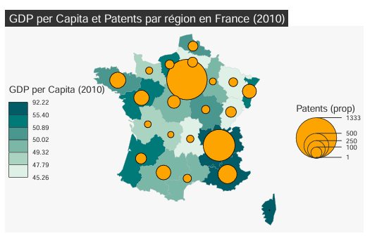

# 🗺️ Analyse spatiale de l'innovation régionale en Europe

---

# 📌 Présentation

Ce projet académique porte sur l'analyse spatiale des disparités régionales de l'innovation en Europe à partir des données **Eurostat** et de la nomenclature **NUTS (Nomenclature of Territorial Units for Statistics)**.

L'objectif est d'explorer les liens entre les dépenses en Recherche & Développement (R&D), le nombre de brevets, le PIB par habitant et le développement économique des territoires grâce à des analyses statistiques et cartographiques réalisées sous **R**.

---

# 🎯 Objectifs du projet

- Nettoyer et préparer les données régionales NUTS.
- Réaliser une analyse statistique descriptive.
- Étudier l'évolution temporelle des dépôts de brevets.
- Cartographier les principaux indicateurs économiques et technologiques.
- Mettre en évidence les disparités régionales en matière d'innovation.
- Analyser les relations entre richesse régionale, R&D et production de brevets.

---

# 📂 Jeu de données

**Source : Eurostat**

Les données utilisées proviennent d'Eurostat et regroupent plusieurs indicateurs régionaux européens :

- Dépenses en Recherche & Développement (R&D)
- Nombre de brevets
- PIB régional
- PIB par habitant
- Population active
- Capital humain

Les analyses sont réalisées à partir du découpage territorial **NUTS**.

---

# 🛠 Technologies utilisées

- R
- Quarto
- sf
- mapsf
- ggplot2
- dplyr
- tidyverse

---

# 📈 Analyse temporelle

## Évolution du nombre total de brevets (1995–2012)

L'analyse montre une progression importante du nombre de brevets entre 1995 et 2008, traduisant une montée en puissance de l'activité d'innovation. Une baisse est observée sur les dernières années de la série, invitant à interpréter ces résultats avec prudence en fonction de la disponibilité des données.

---

# 🗺️ Analyse spatiale

## Cartographie des brevets en France (2010)

Les dépôts de brevets sont fortement concentrés dans quelques régions, notamment l'Île-de-France, illustrant une concentration géographique de l'activité d'innovation.

---

## Cartographie des dépenses en Recherche & Développement

Les investissements en Recherche & Développement suivent une répartition similaire à celle des brevets, avec une concentration autour des principaux pôles économiques et industriels.

---

## Cartographie du PIB par habitant

Cette carte met en évidence les disparités économiques entre les régions françaises, certaines affichant un niveau de richesse nettement supérieur à la moyenne.

---

## Relation entre richesse régionale et innovation

La superposition du PIB par habitant et du nombre de brevets montre une relation positive entre richesse économique et capacité d'innovation. Les régions les plus développées concentrent également davantage de dépôts de brevets.

---

# 📊 Principaux résultats

L'analyse met en évidence plusieurs enseignements :

- Les activités d'innovation sont fortement concentrées dans un nombre limité de régions.
- Les dépenses en R&D et le nombre de brevets présentent une répartition géographique similaire.
- Les régions les plus riches sont également celles qui concentrent le plus d'activités innovantes.
- Les cartes permettent de visualiser les disparités territoriales et d'identifier les principaux pôles d'innovation en France.

---

# 🎯 Compétences mobilisées

Au travers de ce projet, plusieurs compétences ont été développées :

- Préparation et nettoyage de données
- Analyse statistique descriptive
- Analyse spatiale
- Cartographie thématique
- Visualisation de données
- Manipulation de données géographiques (SIG)
- Storytelling par la donnée
- Communication des résultats

---

# 📚 Source des données

- Eurostat
- NUTS – Nomenclature of Territorial Units for Statistics

---

# 👨‍💻 Auteur

**Mamadou Pathé DIALLO**

🎓 Master 2 Études Économiques et Statistiques

📊 Data Scientis| Data Analyst | Business Intelligence | Chargé d'études économiques | Analyse Spatiale | Machine Learning
